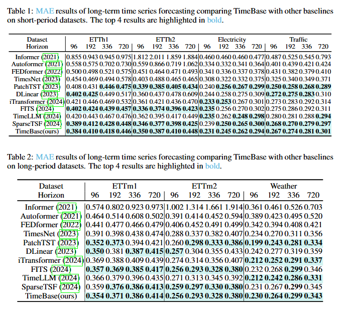
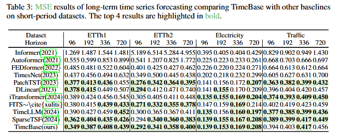
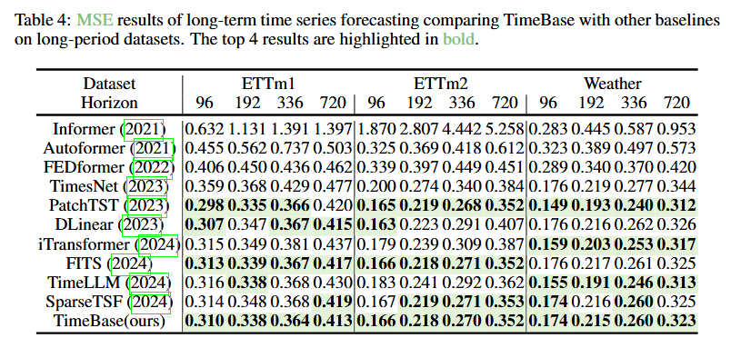

To enhance the reliability of our results, we have included all the scripts and logs for running TimeBase, as well as for the other baselines. For SparseTSF, PatchTST, DLinear, FITS, Time-LLM, Fedformer, and TimesNet, we utilized their official code repositories. For Autoformer and Informer, we leveraged the code provided in the official DLinear repository to run these models. The input length for all baselines was set to 720.

We performed a grid search for TimeBase to find the optimal hyperparameters, specifically for the regularization parameter $\lambda = [0.04, 0.08, 0.12, 0.16, 0.20]$, as well as the learning rate between $ [0.01,0.5]$. For datasets with a period length shorter than the input length, such as ETTH1, ETTH2, Traffic, and Electricity, we set the period length $P = 24 $ and the basis period number $B = 6 $. For datasets with a period length longer than the input length, such as Weather, ETTM1, and ETTM2, we set the period length $P = 4 $. The basis period number for ETTM1 and ETTM2 is set to $B = 20 $, while for Weather, it is set to $B = 6 $.

It is important to note that we have corrected the bug involving `test_loader` where `drop_last=True` during testing on the test set. We have fixed this issue for all models, ensuring that `drop_last=False` is used instead.

To run TimeBase, simply follow these two steps:
1. `cd ./TimeBase-fix_drop_last_bug`
2. `sh ./run_all.sh`

After setting the input length to 720, the comparison of model prediction results is presented in the figure below.

