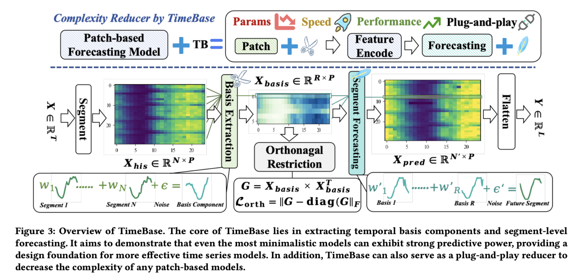
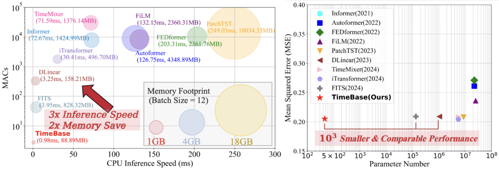
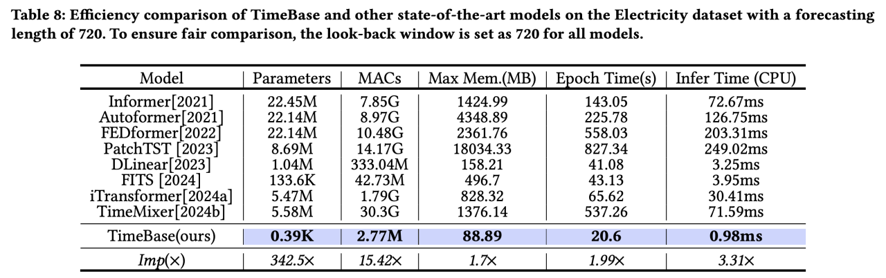

Welcome to the official repository for **TimeBase: The Power of Minimalism in Efficient Long-Term Time Series Forecasting**. To ensure the reliability of our results, all the necessary scripts to run TimeBase are included.






## Data Preparation

For 17 commonly used datasets, including:  
ETTh1, ETTh2, ETTm1, ETTm21, Weather, Electricity, Traffic, Solar Energy, Wind, METR-LA, Exchange Rate, ZafNoo, CzeLan, AQShunyi, and AQWan, we have organized and uploaded the data to [Google Drive](https://drive.google.com/file/d/1ypgCc6iQ2Z8IB_9CY3If_KMRNQKBsI3J/view?usp=sharing). You can download and unzip the files into the `dataset` folder.

For the four large-scale datasets:  
- CA (4.52B)
- GLA (2.02B)
- GBA (1.24B)
- SD (0.38B)  

Please follow the data download and preprocessing instructions provided in [LargeST GitHub](https://github.com/liuxu77/LargeST).

## Implementation Details

We conducted a grid search to optimize the hyperparameters for TimeBase, particularly for the regularization parameter $\lambda = [0.04, 0.08, 0.12, 0.16, 0.20]$ and the learning rate, which ranges from 0.01 to 0.5. For datasets with a period length shorter than the input length (e.g., ETTh1, ETTh2, Traffic, and Electricity), we set the segment period length $P = 24$ and the number of basis vectors $R = 6$. The loss function used is MSE.  Additionally, we have fixed a bug related to the `test_loader`, where `drop_last=True` was incorrectly applied during testing on the test set. We now ensure that `drop_last=False` is used.

## Running Plug-and-play Reducer

```bash
cd plug-ang-play_for_patchtst
sh ./run_all.sh
```
## Running TimeBase

To run TimeBase, simply execute the following command:

```bash
sh ./scripts/$data_name.sh
```

## Results

TimeBase achieves remarkable efficiency, reducing the MACs by 120x, parameter count by 2600x, and inference time by 3x compared to the DLinear, and 15.42x MACs, 342.5x params than the lightest model. Despite these reductions, TimeBase delivers state-of-the-art forecasting performance, ranking in the Top 2 in 158 out of 168 prediction settings.



---

